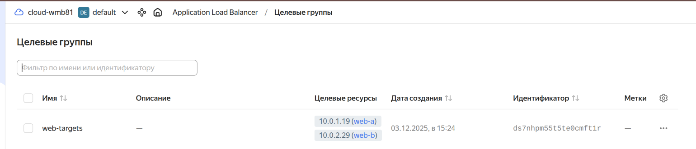
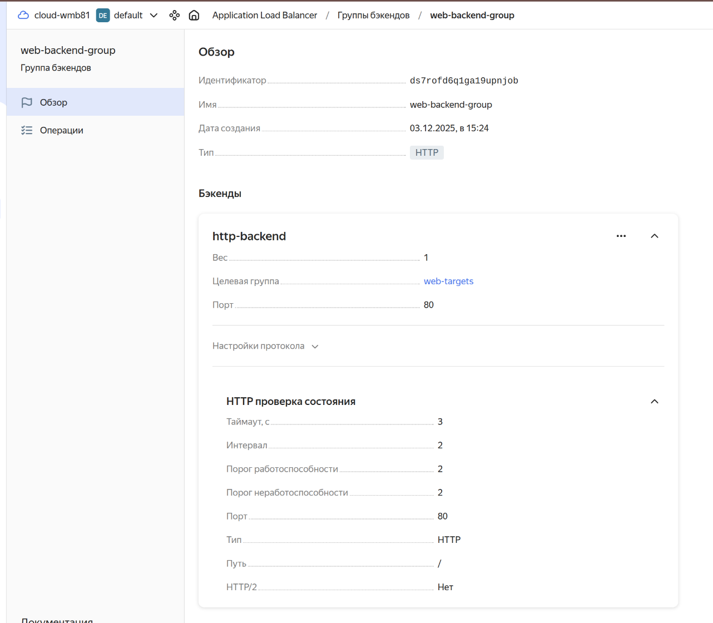
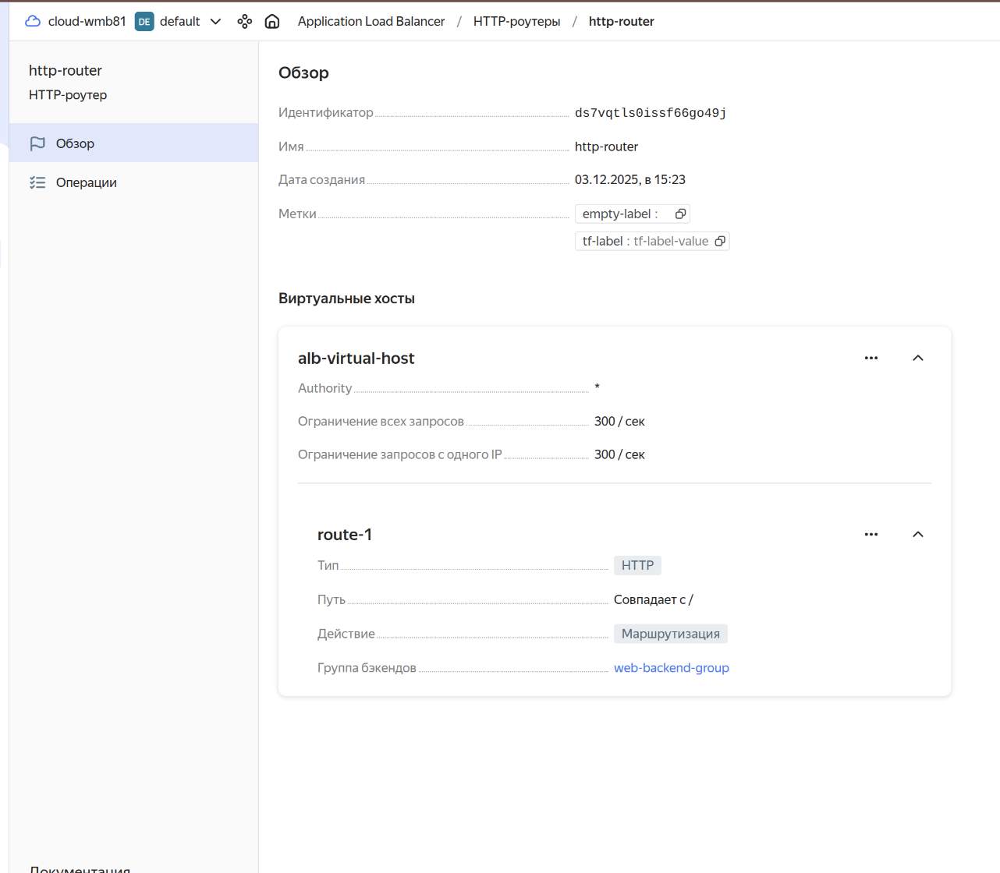
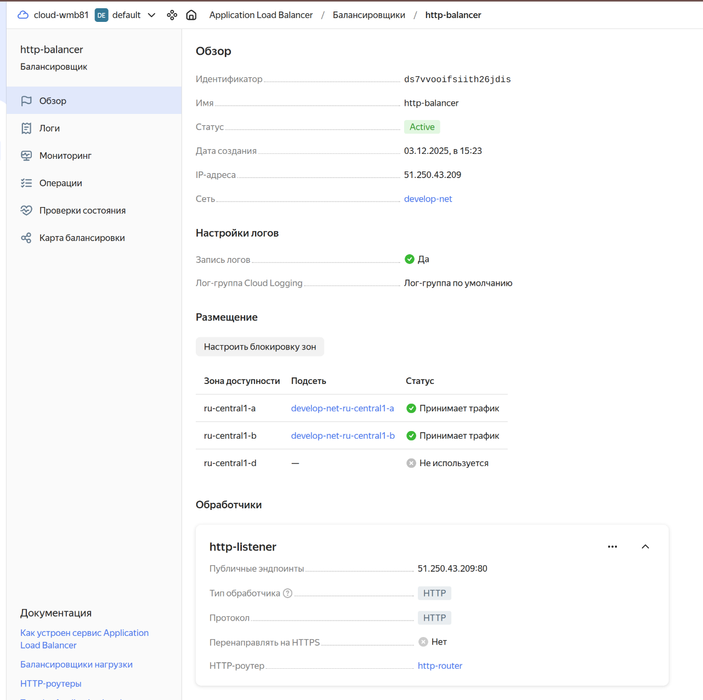
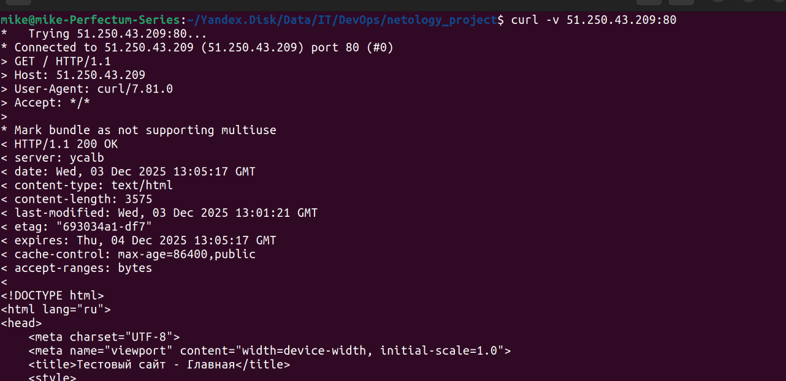
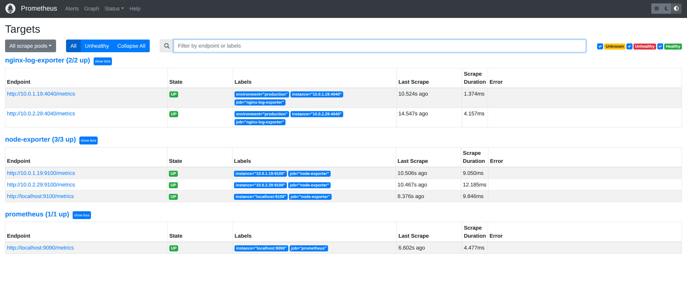

# Курсовая работа на профессии "`DevOps-инженер с нуля`" - `Белов Михаил`

## Задача

Ключевая задача — разработать отказоустойчивую инфраструктуру для сайта, включающую мониторинг, сбор логов и резервное копирование основных данных. Инфраструктура должна размещаться в Yandex Cloud.

[Файл vm.tf описывающий облачную инфраструктуру(виртуальные машины)](./netology_project/vm.tf)

### Сайт

Создайте две ВМ в разных зонах, установите на них сервер nginx, если его там нет. ОС и содержимое ВМ должно быть идентичным, это будут наши веб-сервера.

`Страница Index.html`

[Playbook описывающий установку, настройку nginx и веб-страниц](./netology_project/nginx_install.yml)

Используйте набор статичных файлов для сайта.

Создайте Target Group, включите в неё две созданных ВМ.

Создайте Backend Group, настройте backends на target group, ранее созданную. Настройте healthcheck на корень (/) и порт 80, протокол HTTP.

Создайте HTTP router. Путь укажите — /, backend group — созданную ранее.

Создайте Application load balancer для распределения трафика на веб-сервера, созданные ранее. Укажите HTTP router, созданный ранее, задайте listener тип auto, порт 80.

Протестируйте сайт curl -v <публичный IP балансера>:80

---

### Мониторинг
Создайте ВМ, разверните на ней Prometheus. 

На каждую ВМ из веб-серверов установите Node Exporter и Nginx Log Exporter. Настройте Prometheus на сбор метрик с этих exporter.

Создайте ВМ, установите туда Grafana. Настройте её на взаимодействие с ранее развернутым Prometheus. Настройте дешборды с отображением метрик, минимальный набор — Utilization, Saturation, Errors для CPU, RAM, диски, сеть, http_response_count_total, http_response_size_bytes. Добавьте необходимые tresholds на соответствующие графики.

---

### Логи
Cоздайте ВМ, разверните на ней Elasticsearch. 

[Playbook установки и настройки Elasticsearch](/netology_project/elasticsearch_install.yml)

Установите filebeat в ВМ к веб-серверам, настройте на отправку access.log, error.log nginx в Elasticsearch.

[Playbook установки и настройки Filebeat](/netology_project/filebeat_install.yml)

Создайте ВМ, разверните на ней Kibana, сконфигурируйте соединение с Elasticsearch.

[Playbook установки и настройки Kibana](/netology_project/kibana_install.yml)

`С Kibana пока проблемы...`

---

### Сеть
Разверните один VPC. 

Сервера web, Prometheus, Elasticsearch поместите в приватные подсети.

Сервера Grafana, Kibana, application load balancer определите в публичную подсеть.

Настройте Security Groups соответствующих сервисов на входящий трафик только к нужным портам.

Настройте ВМ с публичным адресом, в которой будет открыт только один порт — ssh. Настройте все security groups на разрешение входящего ssh из этой security group. Эта вм будет реализовывать концепцию bastion host. Потом можно будет подключаться по ssh ко всем хостам через этот хост.

### Резервное копирование
Создайте snapshot дисков всех ВМ. Ограничьте время жизни snaphot в неделю. Сами snaphot настройте на ежедневное копирование.
